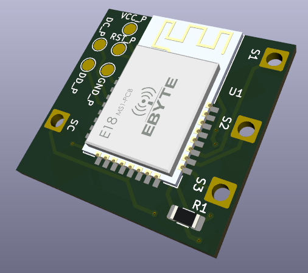
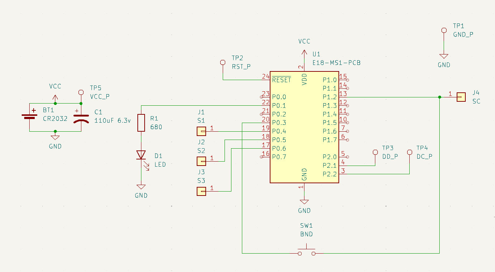

# Schneider Sedna Wallswitch ZigBee board
To make regular switch ZigBee-powered and keep it compact

## Hardware
- E18-MS1-PCB(CC2530 board)
- button
- led
- capacitor
- CR2032 battery holder(multicomp bc2001)
- battery
  
  

### Additions
Pin length - 18mm

## Software

### Firmware
All firmwares are done with great tool [Configurable ZigBee Firmware](https://github.com/ptvoinfo/zigbee-configurable-firmware)
